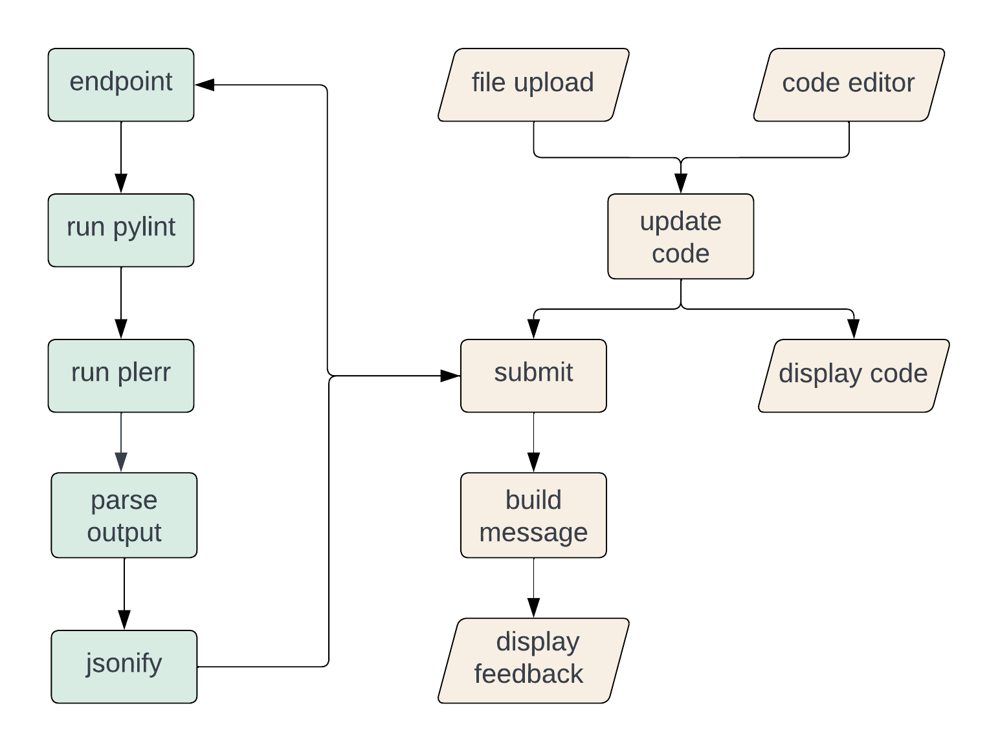

## About

This web application is a simplistic Python code style checking tool meant for usage in undergraduate-level CS classrooms.
The motivation behind this project is to help students learn code style while correcting their own code.

### Built With

* [Node](https://nodejs.org/en/)
* [React JS](https://reactjs.org/)
* [Flask](https://flask.palletsprojects.com/en/2.2.x/)
* [Python 3](https://www.python.org/)


## Getting Started

First, clone this repo on your local machine.
```sh
   git clone https://github.com/kathyyliu/StyleChecker
```
The code for the application is in the `style-checker` directory.
All of the subsequent command line instructions will be executed relative to that directory.
```sh
    cd style-checker
```

### Installation

For the frontend:
1. Install the required node packages
    ```sh
        npm install
    ```

For the backend:
1. Move to the `backend` directory
    ```sh
        cd backend
    ```
2. Create a virtual environment
    ```sh
        python3 -m venv ./venv
    ```
3. Activate the virtual environment
    ```sh
        source venv/bin/activate
    ```
4. Install backend dependencies
    ```sh
        pip install -r requirements.txt
    ```
5. Make a new directory to contain the temporary files for submissions
    ```py
        touch submissions
    ```
6. In line 17 of `app.py`, edit the code to contain the path to your file
    ```py
        dir = 'path/to/your/submissions/file'
    ```

### How To Run

1. Start the React app.
    ```sh
       npm run
    ```
2. In a new terminal, move to the `backend` directory and start the Flask server (with the virtual environment activated).
   ```sh
       cd backend
       source venv/bin/activate
       flask run
    ```
You should now be able to visit and use the app in browser at [http://localhost:3000/](http://localhost:3000/)


## Architechture Overview



This system architecture diagram lays out the flow tasks handled in the backend (green) and frontend (yellow).
The implementation for tasks are spread out through multiple files.

In the `backend` directory:
* `app.py`
  * API endpoint
    * creates temporary files for each submission
* `check.py`
  * runs Pylint and Plerr on submission
  * parses output
  * builds response JSON

On the other hand, all front-end related code are in the `src` directory.
Components and their stylesheets are grouped in sub-directory, `components`.
All of the components here are direct children of `App.js`.

In relation of the components with the diagram:
* `App`
  * handles form submission
    * makes API call to server, passes response data to children
  * updates and stores code input
    * makes file contents appear in code editor
* `FileUpload`
  * takes file input
* `CodeEditor`
  * takes code input
  * displays code
* `Feedback`
  * builds message content from data in backend response
  * displays feedback
    * positions buttons to toggle message on associated line numbers
* `NavBar`
  * hosts submit button


